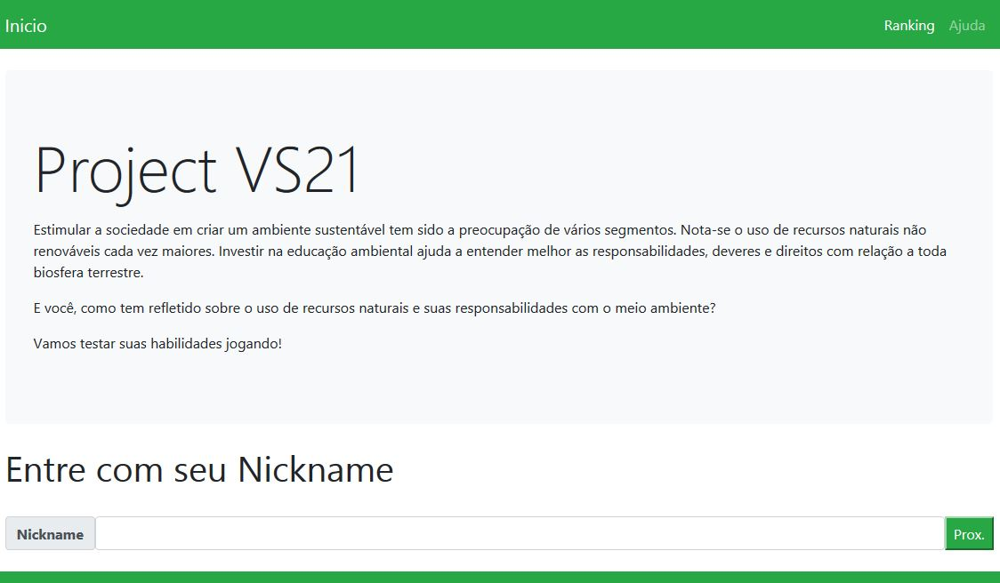
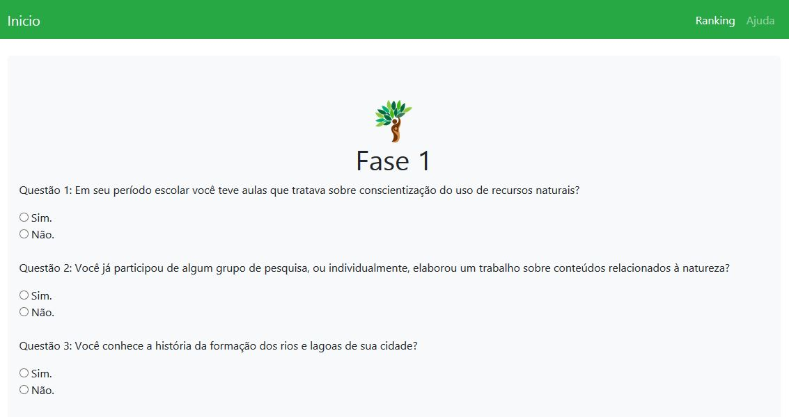
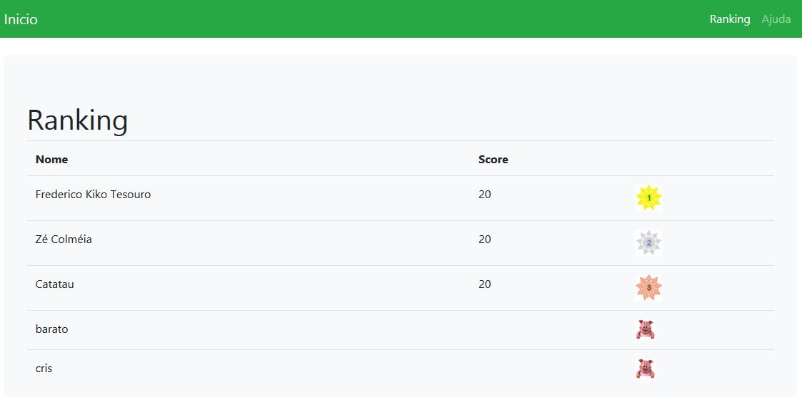

<h1> Project sv21 </h1>
Projeto desenvolvido para o evento <strong>X Mostra de Iniciação Científica e Semana do Conhecimento das faculdades ASSER</strong> em 2018.

<h3> PROJECT SV21: Um quiz sobre vida sustentável </h3>

O projeto foi apresentado na <strong>X Mostra de Iniciação Científica e Semana do Conhecimento das faculdades ASSER</strong> em 2018. A busca palo melhor uso dos recursos do planetam entretanto, o modo de vida atual não pode ser considerado como o ideal para manter condições de sustentar a vida por mais tempo. O objetivo é conscientizar pessoas sobre seu comportamento e como estas se relacionam com o ambiente a sua volta.

O método de pesquisa é experimental, onde dados são coletados por meio de um questionário Web e a cada pergunta respondida pelo usuário é atribuída uma nota. Ao final um ranking aparece com a pontuação do usuário.

O sistema foi construído com <code>HTML, PHP e MySQL</code> com ajuda dos frameworks <code>Bootstrap e RedBeanPHP</code>.

O comportamento do sistema resulta na conscientização do usuário no benefício futuro em manter uma vida sustentável e responsável.

<h3>Sobre</h3>
Professor Cristiano José Cecanho é formado em Sistemas de Informação (2004) pelas faculdades Claretianas, especialista em Tecnologias e Educação a Distância, programador em linguagens como JAVA, PHP, PASCAL, C, C++, Android, com conhecimentos em SQL para bancos de dados como MySQL, MS SQL Server e Firebird.
<h3>Vídeo de apoio/apresentação</h3>
<a href="https://www.youtube.com/user/crispdg">Prof. Cristiano José Cecanho</a>
